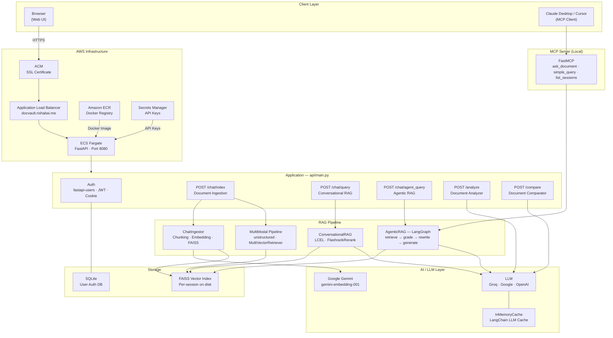
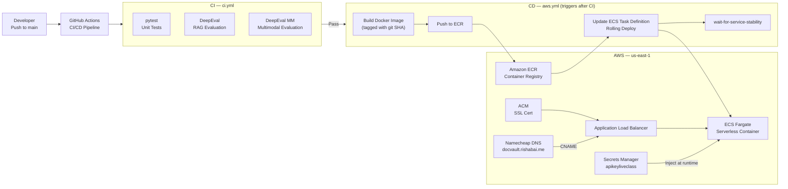

<div align="center">


# DocVault

*AI-powered document intelligence. Chat, analyze, compare, and query — in one platform.*

[Features](#features) · [Architecture](#system-architecture) · [Tech Stack](#tech-stack) · [Local Setup](#local-setup)


DocVault is an AI document platform with **conversational RAG**, **agentic query rewriting** via LangGraph, **multimodal PDF understanding**, structured metadata extraction, and a **built-in MCP server** for Claude Desktop and Cursor. Production-deployed on AWS ECS with a full CI/CD pipeline.

**Live:** [docvault.rishabai.me](https://docvault.rishabai.me)

</div>

---


## Features

| Feature | Description |
|---|---|
| **Document Chat** | Conversational RAG with FAISS retrieval + FlashrankRerank + LangChain LCEL |
| **Agentic RAG** | LangGraph-powered agent that grades retrieved docs and rewrites queries when needed |
| **Multimodal Chat** | PDF chat with image, table, and text understanding via vision LLMs |
| **Document Analyzer** | Extracts structured metadata (title, summary, entities, dates) from any document |
| **Document Comparator** | Page-by-page diff between two documents with LLM-powered change detection |
| **MCP Server** | Connect Claude Desktop or Cursor directly to your indexed documents |

---

## System Architecture



---

## AWS Infrastructure



---

## Tech Stack

### AI & LLM
| Component | Technology |
|---|---|
| LLM Providers | Groq (`llama-3.1-8b-instant`), Google (`gemini-2.5-flash`), OpenAI (`gpt-4o-mini`) |
| Embeddings | Google Gemini (`gemini-embedding-001`) via REST |
| RAG Framework | LangChain LCEL |
| Agentic RAG | LangGraph (retrieve → grade → rewrite → generate) |
| Reranking | FlashrankRerank (cross-encoder, runs locally) |
| Multimodal | `unstructured`, `MultiVectorRetriever`, vision LLMs |
| LLM Cache | LangChain `InMemoryCache` — process-wide, env-toggleable |
| Evaluation | DeepEval — 6 RAG metrics (AnswerRelevancy, Faithfulness, Hallucination, Contextual Precision/Recall/Relevancy) |
| MCP Server | FastMCP — exposes RAG as tools for Claude Desktop / Cursor |

### Backend
| Component | Technology |
|---|---|
| API Framework | FastAPI + Uvicorn |
| Authentication | `fastapi-users` · JWT + Cookie backends · bcrypt |
| Vector Store | FAISS (per-session, disk-based) |
| Auth Database | SQLite via async SQLAlchemy (`aiosqlite`) |
| Logging | `structlog` — structured JSON logs, dual output (console + file) |
| Exception Handling | Custom `DocumentPortalException` — auto-captures file, line, full traceback |

### Infrastructure
| Component | Technology |
|---|---|
| Containerization | Docker |
| Container Registry | Amazon ECR |
| Compute | AWS ECS Fargate (serverless) |
| Load Balancer | AWS Application Load Balancer |
| SSL | AWS Certificate Manager (ACM) |
| Secrets | AWS Secrets Manager |
| DNS | Namecheap → CNAME → ALB |
| CI/CD | GitHub Actions (2 workflows: `ci.yml` + `aws.yml`) |

---

## Project Structure

```
document_p/
├── api/
│   └── main.py                    # FastAPI entrypoint — all routes
├── src/
│   ├── document_chat/
│   │   ├── retrieval.py           # ConversationalRAG (LCEL + reranker)
│   │   ├── agent_rag.py           # AgenticRAG (LangGraph)
│   │   └── multimodal/            # Multimodal RAG pipeline
│   ├── document_analyzer/         # Metadata extraction
│   ├── document_compare/          # Document diff
│   └── document_ingestion/        # Chunking, FAISS indexing
├── mcp_server/
│   └── server.py                  # FastMCP server (local use)
├── eval/
│   ├── run_doc_chat_deepeval.py   # DeepEval — text RAG
│   └── run_mm_doc_chat_deepeval.py # DeepEval — multimodal RAG
├── auth/                          # fastapi-users setup
├── utils/                         # ModelLoader, config, cache
├── prompt/                        # Prompt registry
├── logger/                        # structlog global logger
├── exception/                     # Custom exception
├── config/config.yaml             # LLM + embedding config
├── .github/workflows/
│   ├── ci.yml                     # Tests + DeepEval on every push
│   └── aws.yml                    # Build + Deploy on main
└── Dockerfile
```

---

## Local Setup

```bash
# 1. Clone and install
git clone https://github.com/Rishab-Panwar/documet_p.git
cd documet_p
pip install -r requirements.txt

# 2. Set environment variables
cp .env.example .env
# Fill in: GROQ_API_KEY, GOOGLE_API_KEY, OPENAI_API_KEY

# 3. Run the API
uvicorn api.main:app --host 0.0.0.0 --port 8080 --reload
```

Open [http://localhost:8080](http://localhost:8080)

### MCP Server (Claude Desktop integration)

```bash
pip install mcp
python mcp_server/server.py
```

Add to `claude_desktop_config.json`:
```json
{
  "mcpServers": {
    "docvault": {
      "command": "python",
      "args": ["/absolute/path/to/mcp_server/server.py"]
    }
  }
}
```

Available tools: `ask_document` (agentic RAG), `simple_query` (fast RAG), `list_sessions`

---

## CI/CD Pipeline

```
Push to main
  └── ci.yml
        ├── test         → pytest tests/
        ├── deepeval     → RAG evaluation (non-blocking)
        └── deepeval-mm  → Multimodal RAG evaluation (non-blocking)
              └── [all pass] → aws.yml
                                ├── Build Docker image (tagged with git SHA)
                                ├── Push to Amazon ECR
                                ├── Update ECS Task Definition
                                └── Rolling deploy → wait-for-service-stability
```

- DeepEval jobs have `continue-on-error: true` — eval failures never block deployment
- Docker image tagged with `${{ github.sha }}` — every deploy traceable to a commit
- CD only runs on `main` — feature branches run tests, never deploy

---

## Evaluation — DeepEval

RAG quality is measured on every CI run using [DeepEval](https://github.com/confident-ai/deepeval):

| Metric | Measures |
|---|---|
| Answer Relevancy | Is the answer relevant to the question? |
| Faithfulness | Is the answer grounded in retrieved context? |
| Contextual Precision | Are relevant chunks ranked at the top? |
| Contextual Recall | Were all necessary chunks retrieved? |
| Contextual Relevancy | Are retrieved chunks relevant? |
| Hallucination | Did the LLM introduce facts not in context? |

Judge model: `llama-3.3-70b-versatile` via Groq
